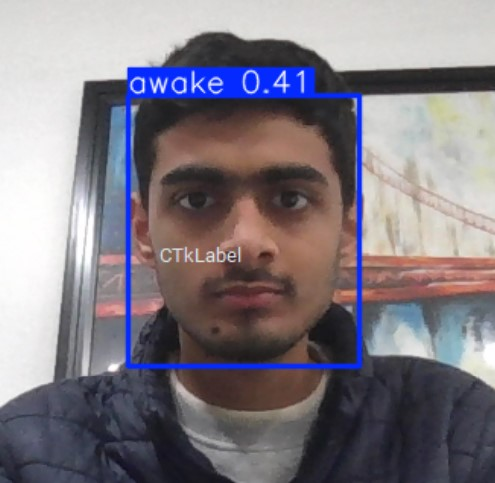
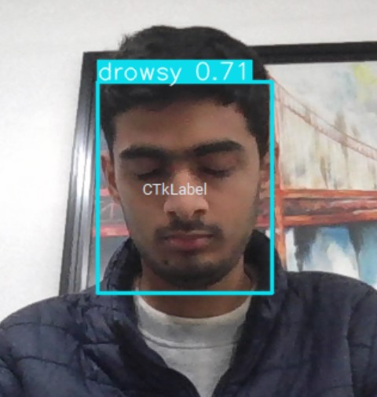

# 😴 Real-Time Drowsiness Detection System

### YOLOv5 • Tkinter • Sound Alerts

A real-time computer vision application that detects drowsiness using a YOLOv5 deep learning model and triggers immediate audio alerts, all within an interactive Tkinter desktop interface.

---

## 📌 Overview

Drowsiness is a major safety concern in driving and operator-based environments.  
This project uses **YOLOv5** to detect signs of drowsiness from live video streams and alerts the user instantly using sound notifications.

The system runs in real time, processes webcam input, and provides visual feedback through a **Tkinter-based GUI**.

---

## ✨ Key Features

- Real-time drowsiness detection
- YOLOv5-based object detection model
- Desktop GUI built with Tkinter
- Instant sound alerts on detection
- Live webcam input support
- Modular and extensible architecture

---

## 🧠 System Workflow

1. Capture live video feed from webcam  
2. Perform inference using YOLOv5  
3. Detect drowsiness-related features  
4. Trigger sound alert if drowsiness is detected  
5. Display results in the GUI  

---

## 🖼️ Screenshots & Demo

### Real-Time Detection

### Alert Triggered

---

## 🛠️ Tech Stack

- **Language:** Python  
- **Deep Learning:** YOLOv5 (PyTorch)  
- **Computer Vision:** OpenCV  
- **GUI:** Tkinter
- **Audio Alerts:** Play audio files using python-vlc

---
